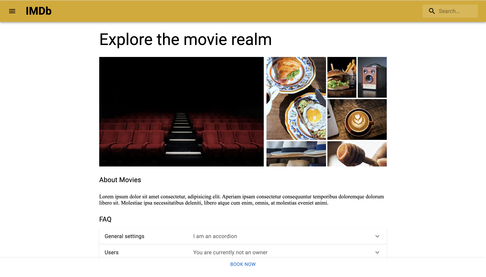
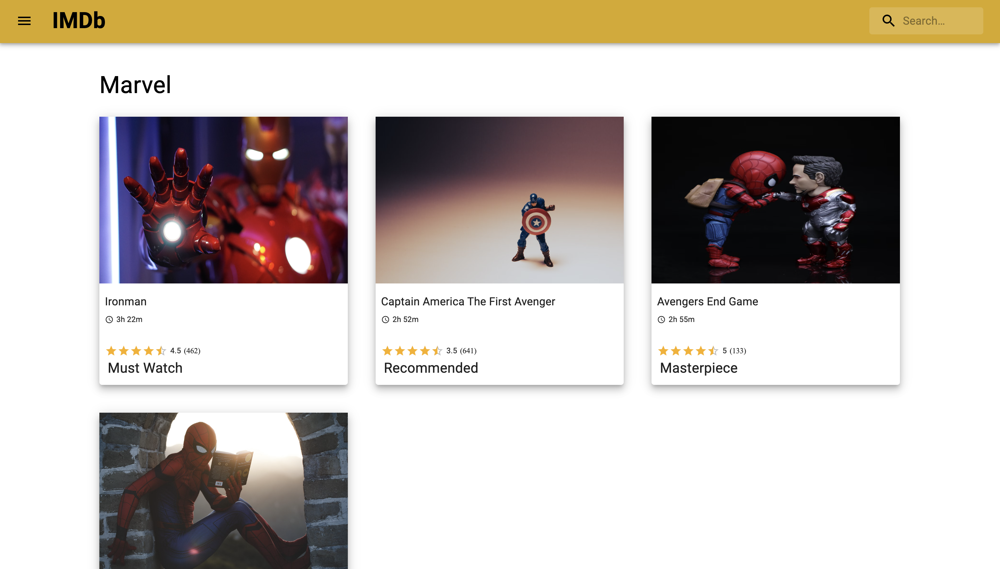

# Getting Started with Material UI IMDB Clone

This project was solely created for learning of different components present in [Material UI](https://mui.com/). Learned different types of component present in Material UI and utilized them to create a small movie rating application.

## Available Scripts

In the project directory, you can run:

### `npm start`

Runs the app in the development mode.\
Open [http://localhost:3000](http://localhost:3000) to view it in your browser.

The page will reload when you make changes.\
You may also see any lint errors in the console.
